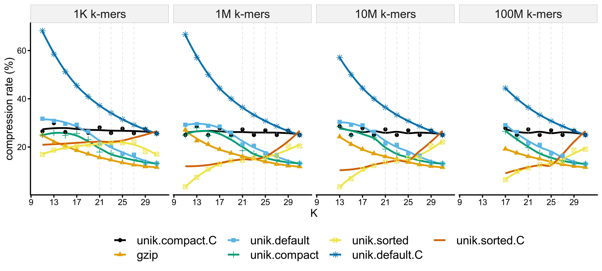

# unikmer

unikmer (unique kmer) is a golang package and a command-line toolkit for
manipulating small [k-mers](https://en.wikipedia.org/wiki/K-mer) (k <= 32)
optional with Taxids but without frequency information.

K-mers (k <= 32) are encoded into `uint64`, stored in builtin `map` of golang in RAM,
and serialized in binary format.

<!-- START doctoc generated TOC please keep comment here to allow auto update -->
<!-- DON'T EDIT THIS SECTION, INSTEAD RE-RUN doctoc TO UPDATE -->
## Table of Contents

- [The package](#the-package)
    - [Installation](#installation)
    - [Benchmark](#benchmark)
- [The toolkit](#the-toolkit)
    - [Installation](#installation-1)
    - [Commands](#commands)
    - [Binary file (.unik)](#binary-file-unik)
    - [Quick Start](#quick-start)
- [Contributing](#contributing)
- [License](#license)

<!-- END doctoc generated TOC please keep comment here to allow auto update -->

## The package

The unikmer package provides basic manipulations of small K-mers
optional with Taxids but without frequency information,
and also provides serialization methods.

### Installation

    go get -u github.com/shenwei356/unikmer

### Benchmark

CPU: AMD Ryzen 7 2700X Eight-Core Processor, 3.7 GHz

    $ go test . -bench=Bench* -benchmem
    goos: linux
    goarch: amd64
    pkg: github.com/shenwei356/unikmer
    BenchmarkEncodeK32-16                           50000000                25.8 ns/op             0 B/op          0 allocs/op
    BenchmarkEncodeFromFormerKmerK32-16             200000000               9.42 ns/op             0 B/op          0 allocs/op
    BenchmarkMustEncodeFromFormerKmerK32-16         1000000000              1.95 ns/op             0 B/op          0 allocs/op
    BenchmarkDecodeK32-16                           20000000                82.2 ns/op            32 B/op          1 allocs/op
    BenchmarkRevK32-16                              50000000                20.2 ns/op             0 B/op          0 allocs/op
    BenchmarkCompK32-16                             50000000                27.8 ns/op             0 B/op          0 allocs/op
    BenchmarkRevCompK32-16                          100000000               21.9 ns/op             0 B/op          0 allocs/op

## The toolkit

`unikmer` is a command-line toolkit providing functions including counting, format
convertion, set operations and searching of small k-mers (k <= 32)
optional with Taxids but without frequency information.

K-mers (k <= 32) are encoded into 'uint64', stored in builtin 'map' of
golang in RAM, and serialized in binary file with extension '.unik'.

Taxids can be assigned when counting k-mers from genome sequences,
and LCA (Lowest Common Ancestor) will be computed during opertions
including computing union, intersecton, set difference, unique and
repeated k-mers.

### Installation

1. Downloading [executable binary files](https://github.com/shenwei356/unikmer/releases) (Latest version).

1. Via Bioconda (not available now)

        conda install unikmer

1. Via Homebrew

        brew install brewsci/bio/unikmer

### Commands

1. Counting

        count           Count k-mers from FASTA/Q sequences

1. Information

        stats           Statistics of binary files
        num             Quickly inspect number of k-mers in binary files

1. Format conversion

        encode          Encode plain k-mer text to integer
        decode          Decode encoded integer to k-mer text
        
        view            Read and output binary format to plain text
        dump            Convert plain k-mer text to binary format

1. Set operations

        head            Extract the first N k-mers
        concat          Concatenate multiple binary files without removing duplicates
        inter           Intersection of multiple binary files
        union           Union of multiple binary files
        diff            Set difference of multiple binary files
        grep            Search k-mers from binary files

        sort            Sort k-mers in binary files to reduce file size
        split           Split k-mers into sorted chunk files
        tsplit          Split k-mers according to taxid
        merge           Merge k-mers from sorted chunk files

        sample          Sample k-mers from binary files
        filter          Filter low-complexity k-mers
        rfilter         Filter k-mers by taxonomic rank

1. Searching

        locate          Locate k-mers in genome
        uniqs           Mapping k-mers back to genome and find unique subsequences

1. Misc

        genautocomplete Generate shell autocompletion script
        help            Help about any command
        version         Print version information and check for update

### Binary file (.unik)

K-mers (represented in `uint64` in RAM ) are serialized in 8-Byte
(or less Bytes for shorter k-mers in compact format,
or much less Bytes for sorted k-mers) arrays and
optionally compressed in gzip format with extension of `.unik`.
Taxids are optionally stored next to k-mers with 4 or less bytes.

#### Compression rate comparison

No Taxids stored in this test.

label           |encoded-kmera|gzip-compressedb|compact-formatc|sortedd|comment
:---------------|:----------------------:|:-------------------------:|:------------------------:|:----------------:|:------------------------------------------------------
`plain`         |                        |                           |                          |                  |plain text
`gzip`          |                        |✔                          |                          |                  |gzipped plain text
`unik.default`  |✔                       |✔                          |                          |                  |gzipped encoded k-mers in fixed-length byte array
`unik.compat`   |✔                       |✔                          |✔                         |                  |gzipped encoded k-mers in shorter fixed-length byte array
`unik.sorted`   |✔                       |✔                          |                          |✔                 |gzipped sorted encoded k-mers

- a One k-mer is encoded as `uint64` and serialized in 8 Bytes.
- b K-mers file is compressed in gzip format by default,
  users can switch on global option `-C/--no-compress` to output non-compressed file.
- c One k-mer is encoded as `uint64` and serialized in 8 Bytes by default.
 However few Bytes are needed for short k-mers, e.g., 4 Bytes are enough for
  15-mers (30 bits). This makes the file more compact with smaller file size,
  controled by global option `-c/--compact `.
- d One k-mer is encoded as `uint64`, all k-mers are sorted and compressed
  using varint-GB algorithm.
- In all test, flag `--canonical` is ON when running `unikmer count`.

### Quick Start

    # memusg is for compute time and RAM usage: https://github.com/shenwei356/memusg

    # counting (only keep the canonical k-mers and compact output)
    # memusg -t unikmer count -k 23 Ecoli-IAI39.fasta.gz -o Ecoli-IAI39.fasta.gz.k23 --canonical --compact
    $ memusg -t unikmer count -k 23 Ecoli-MG1655.fasta.gz -o Ecoli-MG1655.fasta.gz.k23 --canonical --compact
    elapsed time: 1.088s
    peak rss: 210.93 MB
    

    # counting (only keep the canonical k-mers and sort k-mers)
    # memusg -t unikmer count -k 23 Ecoli-IAI39.fasta.gz -o Ecoli-IAI39.fasta.gz.k23.sorted --canonical --compact --sort
    $ memusg -t unikmer count -k 23 Ecoli-MG1655.fasta.gz -o Ecoli-MG1655.fasta.gz.k23.sorted --canonical --compact --sort
    elapsed time: 2.063s
    peak rss: 337.55 MB
    
    
    # counting and assigning global taxids
    $ unikmer count -k 23 -K -c -s Ecoli-IAI39.fasta.gz -o Ecoli-IAI39.fasta.gz.k23.sorted   -t 585057
    $ unikmer count -k 23 -K -c -s Ecoli-MG1655.fasta.gz -o Ecoli-MG1655.fasta.gz.k23.sorted -t 511145
    $ unikmer count -k 23 -K -c -s A.muciniphila-ATCC_BAA-835.fasta.gz -o A.muciniphila-ATCC_BAA-835.fasta.gz.sorted -t 349741
     

    # view
    $ unikmer view Ecoli-MG1655.fasta.gz.k23.sorted.unik --show-taxid | head -n 3
    AAAAAAAAACCATCCAAATCTGG 511145
    AAAAAAAAACCGCTAGTATATTC 511145
    AAAAAAAAACCTGAAAAAAACGG 511145

    
    # stats
    $ unikmer stats *.unik -a -j 10
    file                                              k  gzipped  compact  canonical  sorted  include-taxid  global-taxid     number
    A.muciniphila-ATCC_BAA-835.fasta.gz.sorted.unik  23  ✓        ✕        ✓          ✓       ✕              349741        2,630,905
    Ecoli-IAI39.fasta.gz.k23.sorted.unik             23  ✓        ✕        ✓          ✓       ✕              585057        4,902,266
    Ecoli-IAI39.fasta.gz.k23.unik                    23  ✓        ✓        ✓          ✕       ✕                            4,902,266
    Ecoli-MG1655.fasta.gz.k23.sorted.unik            23  ✓        ✕        ✓          ✓       ✕              511145        4,546,632
    Ecoli-MG1655.fasta.gz.k23.unik                   23  ✓        ✓        ✓          ✕       ✕                            4,546,632
    
    
    # concat
    $ memusg -t unikmer concat *.k23.sorted.unik -o concat.k23 -c
    elapsed time: 1.205s
    peak rss: 60.07 MB

    
    # union
    $ memusg -t unikmer union *.k23.sorted.unik -o union.k23 -c -s
    elapsed time: 5.449s
    peak rss: 709.93 MB
    
    
    # or sorting with limited memory.
    # note that taxonomy database need some memory.
    $ memusg -t unikmer sort *.k23.sorted.unik -o union2.k23 -u -m 1M
    elapsed time: 4.474s
    peak rss: 333.82 MB
    
    $ unikmer view -t union.k23.unik | md5sum 
    4c038832209278840d4d75944b29219c  -
    $ unikmer view -t union2.k23.unik | md5sum 
    4c038832209278840d4d75944b29219c  -
    
    
    # duplicated k-mers
    $ memusg -t unikmer sort *.k23.sorted.unik -o dup.k23 -d -m 1M
    elapsed time: 4.374s
    peak rss: 306.06 MB

    
    # intersection
    $ memusg -t unikmer inter *.k23.sorted.unik -o inter.k23 -c -s
    elapsed time: 2.506s
    peak rss: 194.94 MB
    

    # difference
    $ memusg -t unikmer diff -j 10 *.k23.sorted.unik -o diff.k23 -c -s
    elapsed time: 2.179s
    peak rss: 177.79 MB

    $ ls -lh *.unik
    -rw-r--r-- 1 shenwei shenwei 9.5M  2月 13 00:55 A.muciniphila-ATCC_BAA-835.fasta.gz.sorted.unik
    -rw-r--r-- 1 shenwei shenwei  46M  2月 13 00:59 concat.k23.unik
    -rw-r--r-- 1 shenwei shenwei 8.7M  2月 13 01:00 diff.k23.unik
    -rw-r--r-- 1 shenwei shenwei  11M  2月 13 01:04 dup.k23.unik
    -rw-r--r-- 1 shenwei shenwei  18M  2月 13 00:55 Ecoli-IAI39.fasta.gz.k23.sorted.unik
    -rw-r--r-- 1 shenwei shenwei  21M  2月 13 00:48 Ecoli-IAI39.fasta.gz.k23.unik
    -rw-r--r-- 1 shenwei shenwei  17M  2月 13 00:55 Ecoli-MG1655.fasta.gz.k23.sorted.unik
    -rw-r--r-- 1 shenwei shenwei  19M  2月 13 00:48 Ecoli-MG1655.fasta.gz.k23.unik
    -rw-r--r-- 1 shenwei shenwei 9.5M  2月 13 00:59 inter.k23.unik
    -rw-r--r-- 1 shenwei shenwei  27M  2月 13 01:04 union2.k23.unik
    -rw-r--r-- 1 shenwei shenwei  27M  2月 13 00:58 union.k23.unik

    $ unikmer stats *.unik -a -j 10
    file                                              k  gzipped  compact  canonical  sorted  include-taxid  global-taxid     number
    A.muciniphila-ATCC_BAA-835.fasta.gz.sorted.unik  23  ✓        ✕        ✓          ✓       ✕              349741        2,630,905
    concat.k23.unik                                  23  ✓        ✓        ✓          ✕       ✓                            9,448,898
    diff.k23.unik                                    23  ✓        ✕        ✓          ✓       ✓                            2,326,096
    dup.k23.unik                                     23  ✓        ✕        ✓          ✓       ✓                            2,576,169
    Ecoli-IAI39.fasta.gz.k23.sorted.unik             23  ✓        ✕        ✓          ✓       ✕              585057        4,902,266
    Ecoli-IAI39.fasta.gz.k23.unik                    23  ✓        ✓        ✓          ✕       ✕                            4,902,266
    Ecoli-MG1655.fasta.gz.k23.sorted.unik            23  ✓        ✕        ✓          ✓       ✕              511145        4,546,632
    Ecoli-MG1655.fasta.gz.k23.unik                   23  ✓        ✓        ✓          ✕       ✕                            4,546,632
    inter.k23.unik                                   23  ✓        ✕        ✓          ✓       ✓                            2,576,170
    union2.k23.unik                                  23  ✓        ✕        ✓          ✓       ✓                            6,872,728
    union.k23.unik                                   23  ✓        ✕        ✓          ✓       ✓                            6,872,728

    # -----------------------------------------------------------------------------------------

    # mapping k-mers to genome
    g=Ecoli-IAI39.fasta
    f=inter.k23.unik

    # to fasta
    unikmer view $f -a -o $f.fa.gz

    # make index
    bwa index $g; samtools faidx $g

    ncpu=12
    ls $f.fa.gz | rush -j 1 -v ref=$g -v j=$ncpu \
    ' bwa aln -o 0 -l 17 -k 0 -t {j} {ref} {} \
        | bwa samse {ref} - {} \
        | samtools view -bS > {}.bam; \
        samtools sort -T {}.tmp -@ {j} {}.bam -o {}.sorted.bam; \
        samtools index {}.sorted.bam; \
        samtools flagstat {}.sorted.bam > {}.sorted.bam.flagstat; \
        /bin/rm {}.bam '  

## Contributing

We welcome pull requests, bug fixes and issue reports.

## License

[MIT License](https://github.com/shenwei356/unikmer/blob/master/LICENSE)
