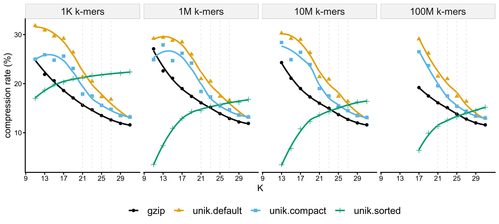

# unikmer: a versatile toolkit for k-mers with taxonomic information

Documents: https://bioinf.shenwei.me/unikmer/

`unikmer` is a toolkit for nucleic acid [k-mer](https://en.wikipedia.org/wiki/K-mer) analysis, 
providing functions
including set operation k-mers (sketch) optional with
TaxIds but without count information.

K-mers are either encoded (k<=32) or hashed ([k<=64, using ntHash v1](https://github.com/bcgsc/ntHash/issues/41)) into `uint64`,
and serialized in binary file with extension `.unik`.

TaxIds can be assigned when counting k-mers from genome sequences,
and LCA (Lowest Common Ancestor) is computed during set opertions
including computing union, intersecton, set difference, unique and
repeated k-mers.

Related projects:

- [kmers](https://github.com/shenwei356/kmers) provides bit-packed k-mers methods for this tool.
- [unik](https://github.com/shenwei356/unik) provides k-mer serialization methods for this tool.
- [sketches](https://pkg.go.dev/github.com/shenwei356/bio/sketches) provides generators/iterators for k-mer sketches 
([Minimizer](https://academic.oup.com/bioinformatics/article/20/18/3363/202143),
 [Scaled MinHash](https://f1000research.com/articles/8-1006),
 [Closed Syncmers](https://peerj.com/articles/10805/)).
- [taxdump](https://github.com/shenwei356/bio/tree/master/taxdump) provides querying manipulations from NCBI Taxonomy taxdump files.

<!-- START doctoc generated TOC please keep comment here to allow auto update -->
<!-- DON'T EDIT THIS SECTION, INSTEAD RE-RUN doctoc TO UPDATE -->
## Table of Contents

- [Using cases](#using-cases)
- [Installation](#installation)
- [Commands](#commands)
- [Binary file](#binary-file)
- [Quick start](#quick-start)
- [Support](#support)
- [License](#license)

<!-- END doctoc generated TOC please keep comment here to allow auto update -->

## Using cases

- Finding conserved regions in all genomes of a species.
- Finding species/strain-specific sequences for designing probes/primers.

## Installation

1. Downloading [executable binary files](https://github.com/shenwei356/unikmer/releases).

1. Via Bioconda  

        conda install -c bioconda unikmer

## Commands

[Usages](https://bioinf.shenwei.me/unikmer/usage)

1. Counting

        count           Generate k-mers (sketch) from FASTA/Q sequences

1. Information

        info            Information of binary files
        num             Quickly inspect the number of k-mers in binary files

1. Format conversion

        view            Read and output binary format to plain text
        dump            Convert plain k-mer text to binary format

        encode          Encode plain k-mer texts to integers
        decode          Decode encoded integers to k-mer texts
        

1. Set operations

        concat          Concatenate multiple binary files without removing duplicates
        inter           Intersection of k-mers in multiple binary files
        common          Find k-mers shared by most of the binary files
        union           Union of k-mers in multiple binary files
        diff            Set difference of k-mers in multiple binary files

1. Split and merge

        sort            Sort k-mers to reduce the file size and accelerate downstream analysis
        split           Split k-mers into sorted chunk files
        tsplit          Split k-mers according to TaxId
        merge           Merge k-mers from sorted chunk files

1. Subset

        head            Extract the first N k-mers
        sample          Sample k-mers from binary files
        grep            Search k-mers from binary files
        filter          Filter out low-complexity k-mers
        rfilter         Filter k-mers by taxonomic rank

1. Searching on genomes

        locate          Locate k-mers in genome
        map             Mapping k-mers back to the genome and extract successive regions/subsequences

1. Misc

        autocompletion  Generate shell autocompletion script
        version         Print version information and check for update

## Binary file

K-mers (represented in `uint64` in RAM ) are serialized in 8-Byte
(or less Bytes for shorter k-mers in compact format,
or much less Bytes for sorted k-mers) arrays and
optionally compressed in gzip format with extension of `.unik`.
TaxIds are optionally stored next to k-mers with 4 or less bytes.

### Compression ratio comparison

No TaxIds stored in this test.

label           |encoded-kmera|gzip-compressedb|compact-formatc|sortedd|comment
:---------------|:----------------------:|:-------------------------:|:------------------------:|:----------------:|:------------------------------------------------------
`plain`         |                        |                           |                          |                  |plain text
`gzip`          |                        |✔                          |                          |                  |gzipped plain text
`unik.default`  |✔                       |✔                          |                          |                  |gzipped encoded k-mers in fixed-length byte array
`unik.compat`   |✔                       |✔                          |✔                         |                  |gzipped encoded k-mers in shorter fixed-length byte array
`unik.sorted`   |✔                       |✔                          |                          |✔                 |gzipped sorted encoded k-mers

- a One k-mer is encoded as `uint64` and serialized in 8 Bytes.
- b K-mers file is compressed in gzip format by default,
  users can switch on global option `-C/--no-compress` to output non-compressed file.
- c One k-mer is encoded as `uint64` and serialized in 8 Bytes by default.
 However few Bytes are needed for short k-mers, e.g., 4 Bytes are enough for
  15-mers (30 bits). This makes the file more compact with smaller file size,
  controled by global option `-c/--compact `.
- d One k-mer is encoded as `uint64`, all k-mers are sorted and compressed
  using varint-GB algorithm.
- In all test, flag `--canonical` is ON when running `unikmer count`.

## Quick Start

    # memusg is for compute time and RAM usage: https://github.com/shenwei356/memusg

    # counting (only keep the canonical k-mers and compact output)
    # memusg -t unikmer count -k 23 Ecoli-IAI39.fasta.gz -o Ecoli-IAI39.fasta.gz.k23 --canonical --compact
    $ memusg -t unikmer count -k 23 Ecoli-MG1655.fasta.gz -o Ecoli-MG1655.fasta.gz.k23 --canonical --compact
    elapsed time: 0.897s
    peak rss: 192.41 MB

    # counting (only keep the canonical k-mers and sort k-mers)
    # memusg -t unikmer count -k 23 Ecoli-IAI39.fasta.gz -o Ecoli-IAI39.fasta.gz.k23.sorted --canonical --sort
    $ memusg -t unikmer count -k 23 Ecoli-MG1655.fasta.gz -o Ecoli-MG1655.fasta.gz.k23.sorted --canonical --sort
    elapsed time: 1.136s
    peak rss: 227.28 MB
    
    
    # counting and assigning global TaxIds
    $ unikmer count -k 23 -K -s Ecoli-IAI39.fasta.gz -o Ecoli-IAI39.fasta.gz.k23.sorted   -t 585057
    $ unikmer count -k 23 -K -s Ecoli-MG1655.fasta.gz -o Ecoli-MG1655.fasta.gz.k23.sorted -t 511145
    $ unikmer count -k 23 -K -s A.muciniphila-ATCC_BAA-835.fasta.gz -o A.muciniphila-ATCC_BAA-835.fasta.gz.sorted -t 349741
    
    # counting minimizer and ouputting in linear order
    $ unikmer count -k 23 -W 5 -H -K -l A.muciniphila-ATCC_BAA-835.fasta.gz -o A.muciniphila-ATCC_BAA-835.fasta.gz.m

    # view
    $ unikmer view Ecoli-MG1655.fasta.gz.k23.sorted.unik --show-taxid | head -n 3
    AAAAAAAAACCATCCAAATCTGG 511145
    AAAAAAAAACCGCTAGTATATTC 511145
    AAAAAAAAACCTGAAAAAAACGG 511145
    
    # view (hashed k-mers needs original FASTA/Q file)
    $ unikmer view --show-code --genome A.muciniphila-ATCC_BAA-835.fasta.gz A.muciniphila-ATCC_BAA-835.fasta.gz.m.unik | head -n 3
    CATCCGCCATCTTTGGGGTGTCG 1210726578792
    AGCGCAAAATCCCCAAACATGTA 2286899379883
    AACTGATTTTTGATGATGACTCC 3542156397282
    
    # find the positions of k-mers
    $ unikmer locate -g A.muciniphila-ATCC_BAA-835.fasta.gz A.muciniphila-ATCC_BAA-835.fasta.gz.m.unik | head -n 5
    NC_010655.1     2       25      ATCTTATAAAATAACCACATAAC 0       .
    NC_010655.1     5       28      TTATAAAATAACCACATAACTTA 0       .
    NC_010655.1     6       29      TATAAAATAACCACATAACTTAA 0       .
    NC_010655.1     9       32      AAAATAACCACATAACTTAAAAA 0       .
    NC_010655.1     13      36      TAACCACATAACTTAAAAAGAAT 0       .

    # info
    $ unikmer info *.unik -a -j 10
    file                                              k  canonical  hashed  scaled  include-taxid  global-taxid  sorted  compact  gzipped  version     number  description
    A.muciniphila-ATCC_BAA-835.fasta.gz.m.unik       23  ✓          ✓       ✕       ✕                            ✕       ✕        ✓        v5.0       860,900             
    A.muciniphila-ATCC_BAA-835.fasta.gz.sorted.unik  23  ✓          ✕       ✕       ✕                    349741  ✓       ✕        ✓        v5.0     2,630,905             
    Ecoli-IAI39.fasta.gz.k23.sorted.unik             23  ✓          ✕       ✕       ✕                    585057  ✓       ✕        ✓        v5.0     4,902,266             
    Ecoli-IAI39.fasta.gz.k23.unik                    23  ✓          ✕       ✕       ✕                            ✕       ✓        ✓        v5.0     4,902,266             
    Ecoli-MG1655.fasta.gz.k23.sorted.unik            23  ✓          ✕       ✕       ✕                    511145  ✓       ✕        ✓        v5.0     4,546,632             
    Ecoli-MG1655.fasta.gz.k23.unik                   23  ✓          ✕       ✕       ✕                            ✕       ✓        ✓        v5.0     4,546,632             
    
    
    # concat
    $ memusg -t unikmer concat *.k23.sorted.unik -o concat.k23 -c
    elapsed time: 1.020s
    peak rss: 25.86 MB

    
    # union
    $ memusg -t unikmer union *.k23.sorted.unik -o union.k23 -s
    elapsed time: 3.991s
    peak rss: 590.92 MB
    
    
    # or sorting with limited memory.
    # note that taxonomy database need some memory.
    $ memusg -t unikmer sort *.k23.sorted.unik -o union2.k23 -u -m 1M
    elapsed time: 3.538s
    peak rss: 324.2 MB
    
    $ unikmer view -t union.k23.unik | md5sum 
    4c038832209278840d4d75944b29219c  -
    $ unikmer view -t union2.k23.unik | md5sum 
    4c038832209278840d4d75944b29219c  -
    
    
    # duplicate k-mers
    # memusg -t unikmer sort *.k23.sorted.unik -o dup.k23 -d -m 1M # limit memory usage
    $ memusg -t unikmer sort *.k23.sorted.unik -o dup.k23 -d
    elapsed time: 1.143s
    peak rss: 240.18 MB

    
    # intersection
    $ memusg -t unikmer inter *.k23.sorted.unik -o inter.k23
    elapsed time: 1.481s
    peak rss: 399.94 MB
    

    # difference
    $ memusg -t unikmer diff -j 10 *.k23.sorted.unik -o diff.k23 -s
    elapsed time: 0.793s
    peak rss: 338.06 MB

    $ ls -lh *.unik
    -rw-r--r-- 1 shenwei shenwei 6.6M Sep  9 17:24 A.muciniphila-ATCC_BAA-835.fasta.gz.m.unik
    -rw-r--r-- 1 shenwei shenwei 9.5M Sep  9 17:24 A.muciniphila-ATCC_BAA-835.fasta.gz.sorted.unik
    -rw-r--r-- 1 shenwei shenwei  46M Sep  9 17:25 concat.k23.unik
    -rw-r--r-- 1 shenwei shenwei 9.2M Sep  9 17:27 diff.k23.unik
    -rw-r--r-- 1 shenwei shenwei  11M Sep  9 17:26 dup.k23.unik
    -rw-r--r-- 1 shenwei shenwei  18M Sep  9 17:23 Ecoli-IAI39.fasta.gz.k23.sorted.unik
    -rw-r--r-- 1 shenwei shenwei  29M Sep  9 17:24 Ecoli-IAI39.fasta.gz.k23.unik
    -rw-r--r-- 1 shenwei shenwei  17M Sep  9 17:23 Ecoli-MG1655.fasta.gz.k23.sorted.unik
    -rw-r--r-- 1 shenwei shenwei  27M Sep  9 17:25 Ecoli-MG1655.fasta.gz.k23.unik
    -rw-r--r-- 1 shenwei shenwei  11M Sep  9 17:27 inter.k23.unik
    -rw-r--r-- 1 shenwei shenwei  26M Sep  9 17:26 union2.k23.unik
    -rw-r--r-- 1 shenwei shenwei  26M Sep  9 17:25 union.k23.unik

    $ unikmer stats *.unik -a -j 10
    file                                              k  canonical  hashed  scaled  include-taxid  global-taxid  sorted  compact  gzipped  version     number  description
    A.muciniphila-ATCC_BAA-835.fasta.gz.m.unik       23  ✓          ✓       ✕       ✕                            ✕       ✕        ✓        v5.0       860,900             
    A.muciniphila-ATCC_BAA-835.fasta.gz.sorted.unik  23  ✓          ✕       ✕       ✕                    349741  ✓       ✕        ✓        v5.0     2,630,905             
    concat.k23.unik                                  23  ✓          ✕       ✕       ✓                            ✕       ✓        ✓        v5.0            -1             
    diff.k23.unik                                    23  ✓          ✕       ✕       ✓                            ✓       ✕        ✓        v5.0     2,326,096             
    dup.k23.unik                                     23  ✓          ✕       ✕       ✓                            ✓       ✕        ✓        v5.0     2,576,170             
    Ecoli-IAI39.fasta.gz.k23.sorted.unik             23  ✓          ✕       ✕       ✕                    585057  ✓       ✕        ✓        v5.0     4,902,266             
    Ecoli-IAI39.fasta.gz.k23.unik                    23  ✓          ✕       ✕       ✕                            ✕       ✓        ✓        v5.0     4,902,266             
    Ecoli-MG1655.fasta.gz.k23.sorted.unik            23  ✓          ✕       ✕       ✕                    511145  ✓       ✕        ✓        v5.0     4,546,632             
    Ecoli-MG1655.fasta.gz.k23.unik                   23  ✓          ✕       ✕       ✕                            ✕       ✓        ✓        v5.0     4,546,632             
    inter.k23.unik                                   23  ✓          ✕       ✕       ✓                            ✓       ✕        ✓        v5.0     2,576,170             
    union2.k23.unik                                  23  ✓          ✕       ✕       ✓                            ✓       ✕        ✓        v5.0     6,872,728             
    union.k23.unik                                   23  ✓          ✕       ✕       ✓                            ✓       ✕        ✓        v5.0     6,872,728

    # -----------------------------------------------------------------------------------------

    # mapping k-mers to genome
    seqkit seq Ecoli-IAI39.fasta.gz -o Ecoli-IAI39.fasta
    g=Ecoli-IAI39.fasta
    f=inter.k23.unik
    # mapping k-mers back to the genome and extract successive regions/subsequences
    unikmer map -g $g $f -a | more
    
    
    # using bwa
    # to fasta
    unikmer view $f -a -o $f.fa.gz
    # make index
    bwa index $g; samtools faidx $g
    ncpu=12
    ls $f.fa.gz \
        | rush -j 1 -v ref=$g -v j=$ncpu \
            'bwa aln -o 0 -l 17 -k 0 -t {j} {ref} {} \
                | bwa samse {ref} - {} \
                | samtools view -bS > {}.bam; \
             samtools sort -T {}.tmp -@ {j} {}.bam -o {}.sorted.bam; \
             samtools index {}.sorted.bam; \
             samtools flagstat {}.sorted.bam > {}.sorted.bam.flagstat; \
             /bin/rm {}.bam '  

## Support

Please [open an issue](https://github.com/shenwei356/unikmer/issues) to report bugs,
propose new functions or ask for help.

## License

[MIT License](https://github.com/shenwei356/unikmer/blob/master/LICENSE)
