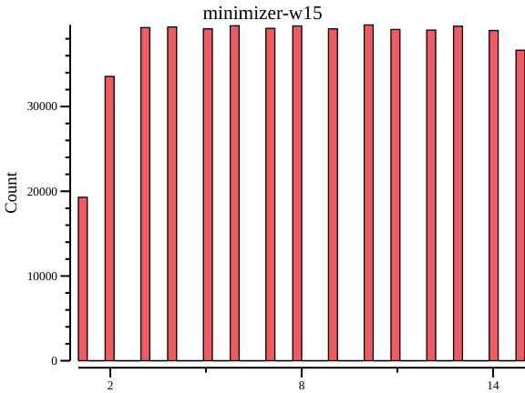
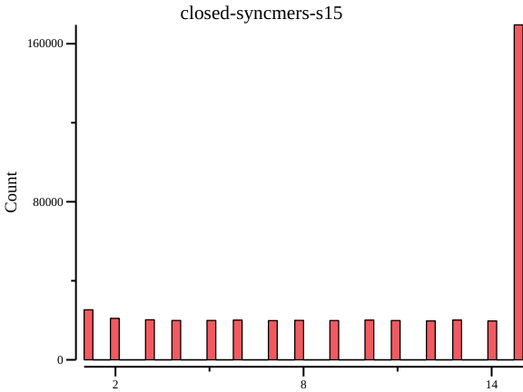
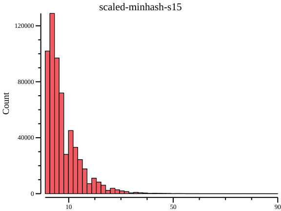

# Distances between consecutive k-mers

Number of k-mers sketches:
    
    unikmer num -n *.unik
    
    446227  closed-syncmers-s15.unik
    549963  minimizer-w15.unik
    586734  scaled-minhash-s15.uni
    

Distribution of distances between consecutive k-mers. Parameters:

- Minimizer: k=31, w=15
- Closed Syncmers: k=31, s=16 (roughly equal to w=15)
- Scaled MinHahs: k=31, scale=15

Steps:
    
    # tools:
    #     seqkit: https://github.com/shenwei356/seqkit
    #     unikmer: https://github.com/shenwei356/unikmer
    #     csvtk: https://github.com/shenwei356/csvtk
    #     rush: https://github.com/shenwei356/rush

    genome=Ecoli-MG1655.fasta.gz
    
    

    # -------------------------------
    # compute
    
    # minimizer (w=15)
    unikmer count -k 31 -K -s $genome -H -W 15 -o minimizer-w15

    # closed-syncmers (s=16)
    unikmer count -k 31 -K -s $genome -H -S 16 -o closed-syncmers-s15
    
    # scaled minhash (scale=15)
    unikmer count -k 31 -K -s $genome -H -D 15 -o scaled-minhash-s15
 

    
    # -------------------------------
    # mapping
    
    # convert to FASTA
    ls *.unik \
        | rush -v ref=$genome \
            'unikmer view -g {ref} {} \
                | awk "{print \$1\"\t\"\$1}" \
                | seqkit tab2fx -o {}.fasta.gz'
    
    # mapping
    ls *.unik.fasta.gz \
        | rush -v ref=$genome \
            'seqkit locate -j 5 --use-fmi --bed -f {} {ref} \
                | sort -k 2,2n -k 6,6 \
                > {}.bed'
    
    
    # -------------------------------
    # ploting
    
    # compute interval
    ls *.bed \
        | rush -q 'perl -ane "$loc=$F[1]; if($pre==0){$pre=$loc and next;} $d=$loc-$pre; print qq($d\n); $pre=$loc;" {} > {}.interval'
    
    # plot
    ls *.interval \
        | rush 'csvtk plot hist -Ht {} --title {:} -o {}.hist.png'
        
